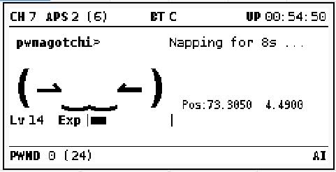
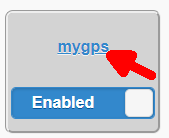
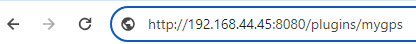

## Plugins for pwnagotchi

Here you will find some plugins I created or modified.

#### myGPS.py

Because PAW server is not compatible with my phone, I implemented another method to get the GPS postion from the phone.

I use an app called GPSLogger https://gpslogger.app/ on the phone to send the GPS postion to the pwnagotchi.

The plugin on the pwnagotchi receives the GPS postion and displays it. If a new handshare is detected, it saves the GPS position.

You can use the webgpsmap plugin for a nice map.

#### wpa.sec.py

I added support for .pcad.cracked files, so that you can see the password in the webgpsmap plugin.
After downloading the passwords it creates pcad.cracked files for all found passwords.

## Installation & Configuration

#### myGPS.py

-   Activate and configurate bt-teher plugin.  
    (Don't forget to activate bluetooth tethering in phone setting)

    You have be able to access the web ui of pwnagotchi from your phone !

    Copy mypgs.py to the pwnagotchi plugin directory, restart and activate the plugin.
    Click the mygps link under plugins to get the URL for the GPSLogger app:

    

    (e.g. http://192.168.44.45:8080/plugins/mygps) - IP depends on your bt-tether configuration.

    

-   Install the GPSLogger app.

    Set custom URL in the app to the URL of the mypgs plugin.

    Start the service and check for errors in the protocol view of the GPSLogger app.

#### wpa-sec.py

-   Make a backup of the old wpa-sec.py file
-   Copy wpa-sec.py to the pwnagotchi plugin directory, restart and activate the plugin.

## Changelog

<!--
	Placeholder for the next version (at the beginning of the line):
	### **WORK IN PROGRESS**
-->

### 0.0.1 (2024-02-09)

-   (inbux) initial release

## License

MIT License

Copyright (c) 2024 inbux <inbux.development@gmail.com>

Permission is hereby granted, free of charge, to any person obtaining a copy
of this software and associated documentation files (the "Software"), to deal
in the Software without restriction, including without limitation the rights
to use, copy, modify, merge, publish, distribute, sublicense, and/or sell
copies of the Software, and to permit persons to whom the Software is
furnished to do so, subject to the following conditions:

The above copyright notice and this permission notice shall be included in all
copies or substantial portions of the Software.

THE SOFTWARE IS PROVIDED "AS IS", WITHOUT WARRANTY OF ANY KIND, EXPRESS OR
IMPLIED, INCLUDING BUT NOT LIMITED TO THE WARRANTIES OF MERCHANTABILITY,
FITNESS FOR A PARTICULAR PURPOSE AND NONINFRINGEMENT. IN NO EVENT SHALL THE
AUTHORS OR COPYRIGHT HOLDERS BE LIABLE FOR ANY CLAIM, DAMAGES OR OTHER
LIABILITY, WHETHER IN AN ACTION OF CONTRACT, TORT OR OTHERWISE, ARISING FROM,
OUT OF OR IN CONNECTION WITH THE SOFTWARE OR THE USE OR OTHER DEALINGS IN THE
SOFTWARE.
